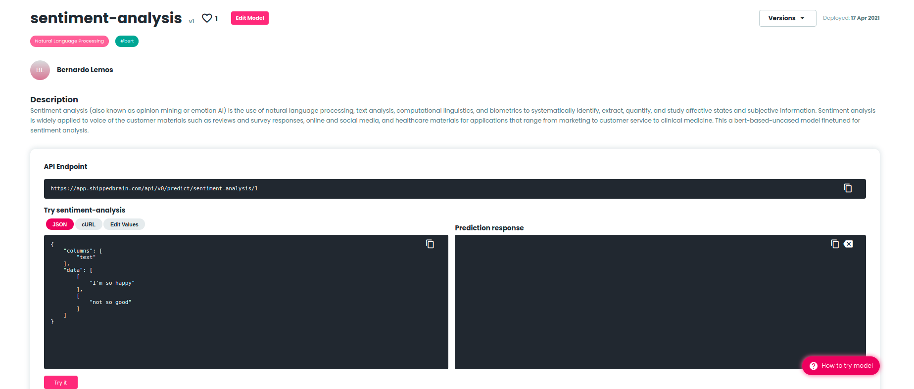

## `shippedbrain`
### Client library to publish models on [app.shippedbrain.com](app.shippedbrain.com)
Create **serverless REST endpoints** for machine learning models and get **hosted web pages** instantly.

Using the CLI:

`shippedbrain upload --model_name My-Amazing-Model --run_id 6f252757005748708cd3aad75d1ff462`

Using the Python API:

```
from shippedbrain import shippedbrain

# cutom code...

shippedbrain.upload(email=<your_email>, password=<your_password>, run_id=<some_run_id>, model_name=<your_model_name>)
```

# Shipped Brain
[Shipped Brain](shippedbrain.com) is an AI platform that allows anyone to share and upload machine lerning models fast and easily.


### Managed REST API endpoints
####Use anywhere
When a model is published on [app.shippedbrain.com](app.shippedbrain.com) it gets its unique and standardized REST API endpoint automatically that can be embedded anywhere.

To use a shipped brain model you just need to make an HTTP POST request to the model's endpoint:

```app.shippedbrain.com/api/v0/<your-model-name>/<version>```

* Straightfoward deployments with one line of code 
* Public REST endpoints that anyone can try and verify - managed for you
* No serving code and zero configuration

### Hosted Model Pages
####Interactive web pages to get started easily
An interactive web page for every model - automatically created and hosted for you.

Share your models' web pages and allow anyone to experiment with your models in the browser or using the REST API.

* An interactive web page for every model - automatically created and hosted for you
* In-app experimentation using model input examples
* Auto-generated model signatures on your models' web pages



### Data Science Portfolio
**Build a home for your AI.**

Start creating your data science portfolio. Share you Shipped Brain profile with other AI specialists, companies or include it in your resumé. Your shipped brain profiles is a great way to showcase all your models.

* Leverage Shipped Brain's profiles and infrastructure to manage your online presence as an AI specialist
* Share your profile and models on social media platforms with one click


## About `shippedbrain`
The `shippedbrain` client library provides a convenient way to publish models on [app.shippedbrain.com](app.shippedbrain.com).

It integrates with the widely used `mlflow` library, so any `mlflow` model will work on shipped brain. To publish a model on [app.shippedbrain.com](app.shippedbrain.com) you just need to provide a valid `mlflow` **run_id** of a logged model.  You can easily log models with `mlflow` using `mlflow.log_model`.

For more information on how to log models with `mlflow`read the [documentation](https://www.mlflow.org/docs/latest/models.html)

Once you've logged your model you just need to refer the **mlflow `run_id`** when uploading a model to shipped brain.
####CLI Example
`shippedbrain upload --run_id <some_run_id> --model_name <my-model-name>`

## Usage
The `shippedbrain` client library has a **Python API** and **CLI** flavors.

### CLI
`shippedbrain [OPTIONS] COMMAND [ARGS]...`

####Commands
```
upload - Deploy a model to app.shippedbrain.com : create a REST endpoint and hosted model page
```
##### Environment variables (advised)
* `SHIPPED_BRAIN_EMAIL` to skip de email prompt.
* `SHIPPED_BRAIN_PASSWORD` to skip de passoword prompt.

#### `upload` command
Deploy a model to [app.shippedbrain.com](app.shippedbrain.com) - create a REST endpoint and get a hosted model web page

#####Options:
```
  -r, --run_id TEXT      The run_id of logged mlflow model  [required]
  -m, --model_name TEXT  The model name to display on app.shippedbrain.com [required]
  -f, --flavor TEXT      The mlflow flow flavor of the model
  --help                 Get help on how to use the 'upload' command
```

#####Example:
Run:

`shippedbrain upload --run_id <some_run_id> --model_name <my-model-name>`

Prompt:

The command above will prompt the user to input their shipped brain email and password.
```
email: your@email.com
password: 
```

If the environment variables `SHIPPED_BRAIN_EMAIL` or `SHIPPED_BRAIN_PASSWORD` are set, the respective prompt options will be skipped.

### Python API
To publish a model programatically you just need call the `shippedbrain.upload` function.

####`shippedbrain.upload`
#####Arguments:
* `email` (**str**) - shipped brain account email
* `password` (**str**) - shipped brain account password
* `run_id` (**str**) - run_id of logged mlflow model
* `model_name` (**str**) - model name to display on app.shippedbrain.com

##### Example
You can easily publish a model with one line of code:

```python
from shippedbrain import shippedbrain

# your custom code ...
shippedbrain.upload_run(email="<your@email.com>", password="<your_password>", model_name="<model-name>",
                        run_id="<model-run-id>")
```

###End-to-end example
You can find an example under the `./examples/elastic_net` directory.
* `train_and_log.py`: trains linear model and logs it to mlflow
* `requirements.txt`: python requirements to run example

Before running the `./examples/elastic_net/train_and_log.py` script you should update the following variables:
* `SHIPPED_BRAIN_EMAIL` with your shipped brain account email
* `SHIPPED_BRAIN_PASSWORD` with your shipped brain account password
* `MODEL_NAME` with the name of your published model on shipped brain 

Run the example:
* Install the requirements: `pip install -r ./examples/elastic_net/`
* Train and publish the model: `python ./examples/elastic_net/train_and_log.py --publish`

You can omit the `--publish` flag if you do not want your model to be published on [app.shippedbrain.com](app.shippedbrain.com)

**Output example:**
```
```

#### Using the CLI
To upload the trained model to app.shippedbrain.com you just need to collect the `run_id` of the logged model:
* `--model_name` - specify the model name published on app.shippedbrain.com
* `--run_id` - the **run_id** of the logged model 

Run: `shippedbrain upload --model_name ElasticWine --run_id <some_run_id>`

#### Typical workflow integration using the Python API

If `SHIPPED_BRAIN_EMAIL` and/or `SHIPPED_BRAIN_PASSWORD` are set arguments `email` and `password` can be left blank, respectively

```python
import mlflow
from shippedbrain import shippedbrain

# other imports...

SHIPPED_BRAIN_EMAIL = "your_email@mail.com"
SHIPPED_BRAIN_PASSWORD = "your_password"
MODEL_NAME = "ElasticWine"

with mlflow.start_run() as run:
    # required to upload a valid model on shipped brain
    signature =  # use mlflow.models.signature.infer_signature
    input_example =  # one input example of your data Union[pandas.DataFrame | numpy.ndarray] 

    # train model
    model =  # trained model

    # log model
    mlflow.sklearn.log_model(model, "model", signature=signature, input_example=input_example)
    print(f"run_id='{run.info.run_id}'")

    # publish model
    shippedbrain.upload_run(email=SHIPPED_BRAIN_EMAIL, password=SHIPPED_BRAIN_PASSWORD, run_id=run.info.run_id,
                            model_name=MODEL_NAME)
```